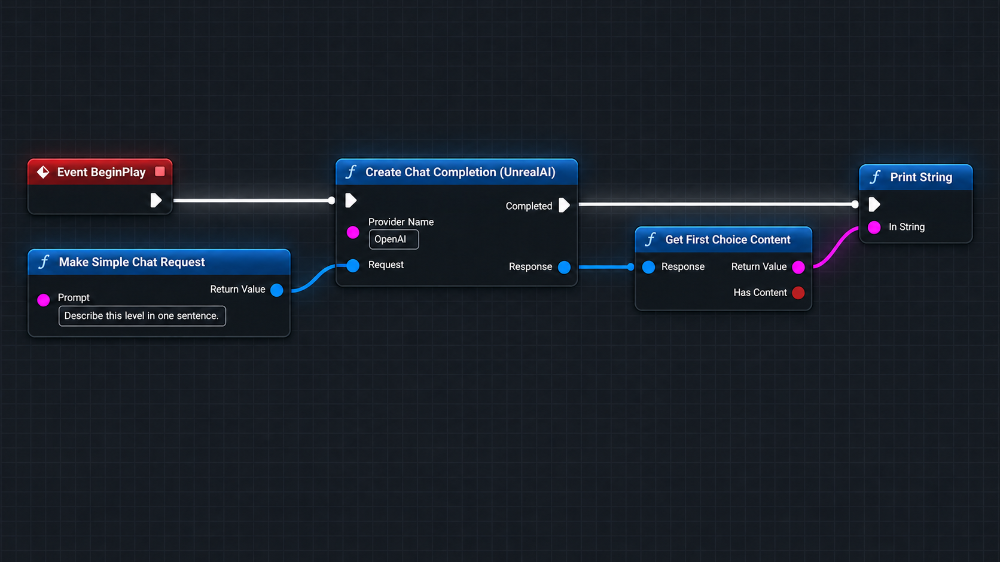

# UnrealAI provider and API guide

UnrealAI is a provider-neutral Unreal Engine runtime SDK. One chat contract supports one-shot responses and text-first Server-Sent Events (SSE) across three wire protocols:

| Profile | One-shot request | Streaming request | Default model | API key variable |
| --- | --- | --- | --- | --- |
| `OpenAI` | `POST {BaseUrl}/chat/completions` | same endpoint with `stream: true` | `gpt-5.6-luna` | `OPENAI_API_KEY` |
| `XAI` | `POST {BaseUrl}/chat/completions` | same endpoint with `stream: true` | `grok-4.6` | `XAI_API_KEY` |
| `Anthropic` | `POST {BaseUrl}/messages` | same endpoint with `stream: true` | `claude-sonnet-5` | `ANTHROPIC_API_KEY` |
| `Gemini` | `POST {BaseUrl}/models/{model}:generateContent` | `POST {BaseUrl}/models/{model}:streamGenerateContent?alt=sse` | `gemini-3.7-flash` | `GEMINI_API_KEY` |

OpenAI and XAI share the OpenAI-compatible adapter. Anthropic and Gemini use their native request, authentication, error, response, and usage formats. The adapters normalize ordinary text conversations into `FUnrealAIChatResponse` while preserving the provider response in `RawJson`.

For a complete consuming project, open the [UnrealAI sample](../Samples/UnrealAISample/README.md). It includes buildable C++, a compiled Blueprint graph, a starter level, offline asset checks, and opt-in live provider tests.

Before planning a shipped integration, review the [production-readiness gaps and remediation plan](ProductionReadiness.md). It distinguishes current launch blockers from longer-term SDK maturity work and defines acceptance criteria for closing each gap.

## Install in another project

Copy `Plugins/UnrealAI` into the target project's `Plugins` folder, then enable it in the target `.uproject`:

```json
{
  "Name": "UnrealAI",
  "Enabled": true
}
```

Regenerate project files if needed and rebuild. C++ consumers must add `UnrealAI` to the appropriate dependency list in their module's `.Build.cs`.

See [Native SDK and optional authentication](NativeSDK.md) for `FUnrealAIExecutionService`, native model providers, limits, client/server credentials, and optional addon installation. Existing Blueprint node names and provider factories remain compatible.

## Configure providers

Project Settings → Plugins → UnrealAI exposes provider profiles. A profile selects an `EUnrealAIProviderApi` protocol and supplies its base URL, default model, environment-variable names, timeout, retry policy, and optional headers.

For local editor development, copy the plugin's `.env.example` to the consuming project's root as `.env`, then add only the keys needed by that project. UnrealAI loads the project-root file before resolving a profile; an existing process environment variable takes precedence.

```text
<copy command for the current host> Plugins/UnrealAI/.env.example <project root>/.env
```

Built-in optional overrides are `OPENAI_BASE_URL`/`OPENAI_MODEL`, `XAI_BASE_URL`/`XAI_MODEL`, `ANTHROPIC_BASE_URL`/`ANTHROPIC_MODEL`, and `GEMINI_BASE_URL`/`GEMINI_MODEL`. For compatibility with earlier UnrealAI releases, XAI falls back to the OpenAI base URL and model variables only when its XAI-specific variables are unset.

The `.env` loader does not replace process values it does not own. Use `Reload Project Env File` from Blueprint to reload values during editor testing.

Never store a real API key in project settings, Blueprint assets, logs, screenshots, or a packaged client. A production game should call a trusted backend that owns hosted-provider credentials.

## C++ provider factories

`UUnrealAIProviders` provides a clean provider-level creation surface:

```cpp
// Declare these members on the UObject that owns the request.
UPROPERTY()
TObjectPtr<UUnrealAIClient> UnrealAIClient;

FUnrealAIRequestHandle ActiveCompletion;

void HandleChatCompletion(
    const FUnrealAIChatResponse& Response,
    const FUnrealAIError& Error);
void HandleRetry(const FUnrealAIRetryEvent& RetryEvent);
```

Then create the retained client and request from that object's implementation:

```cpp
#include "UnrealAIBlueprintLibrary.h"
#include "UnrealAIProviders.h"

FUnrealAIError ConfigError;
UnrealAIClient = UUnrealAIProviders::Anthropic(this, ConfigError);
if (!UnrealAIClient)
{
    UE_LOG(LogTemp, Error, TEXT("UnrealAI configuration failed: %s"), *ConfigError.Message);
    return;
}

const FUnrealAIChatRequest Request =
    UUnrealAIBlueprintLibrary::MakeSimpleChatRequest(
        TEXT("Summarize this level objective in one sentence."));

ActiveCompletion = UnrealAIClient->CreateChatCompletion(
    Request,
    FUnrealAIChatCompletionNativeDelegate::CreateUObject(
        this,
        &ThisClass::HandleChatCompletion),
    FUnrealAIRetryNativeDelegate::CreateUObject(
        this,
        &ThisClass::HandleRetry));
```

The built-in factories are:

- `UUnrealAIProviders::OpenAI(Outer, OutError, ModelOverride)`
- `UUnrealAIProviders::XAI(Outer, OutError, ModelOverride)`
- `UUnrealAIProviders::Anthropic(Outer, OutError, ModelOverride)`
- `UUnrealAIProviders::Gemini(Outer, OutError, ModelOverride)`

Leave the optional model override empty to use the resolved profile default. `OpenAICompatibleFromProfile` creates a client from a named compatible profile. `OpenAICompatible` accepts a complete `FUnrealAIProviderConfig` and forces the compatible Chat Completions protocol, which is useful for local model servers and gateways.

The existing `NewObject<UUnrealAIClient>(Outer)` plus `ConfigureFromSettings` flow remains supported. In either flow, retain the client in a `UPROPERTY`, handle `FUnrealAIError` before reading the response, and tolerate successful responses with no choices.

## C++ streaming

Use the dedicated streaming API instead of setting `FUnrealAIChatRequest::bStream`. Keep `FUnrealAIRequestHandle ActiveStream` and `FString StreamingText` as members of the object that owns the retained client:

```cpp
ActiveStream = UnrealAIClient->StreamChatCompletion(
    Request,
    FUnrealAIChatStreamEventNativeDelegate::CreateWeakLambda(
        this,
        [this](const FUnrealAIChatStreamEvent& Event)
        {
            if (Event.Type == EUnrealAIChatStreamEventType::TextDelta)
            {
                StreamingText += Event.TextDelta;
            }
        }),
    FUnrealAIChatStreamTerminalNativeDelegate::CreateWeakLambda(
        this,
        [this](const FUnrealAIChatStreamResult& Result)
        {
            ActiveStream = FUnrealAIRequestHandle();
            if (Result.Status == EUnrealAIChatStreamStatus::Failed)
            {
                UE_LOG(LogTemp, Error, TEXT("UnrealAI stream failed: %s"), *Result.Error.Message);
            }
        }));
```

Keep the client alive as a `UPROPERTY`. Store the returned `FUnrealAIRequestHandle` when cancellation is needed, then call `CancelRequest(ActiveStream)`. Event, retry, and terminal callbacks run in order on the game thread. The terminal callback fires exactly once with `Completed`, `Failed`, or `Cancelled`; its response is complete on success and partial after a failure or cancellation.

## Blueprint usage

Use `Make Simple Chat Request`, then call `Create Chat Completion (UnrealAI)` for a one-shot result or `Stream Chat Completion (UnrealAI)` for incremental events.

- `Provider Name`: `OpenAI`, `XAI`, `Anthropic`, `Gemini`, a custom profile, or empty to use the default.
- `Completed`: receives `FUnrealAIChatResponse`; use `Get First Choice Content` and branch on `Has Content`.
- `Retrying`: reports the retry number, delay, reason, and HTTP status before a new attempt.
- `Failed`: receives `FUnrealAIError`; handle its message without exposing request or credential data.
- `Cancelled`: is the distinct one-shot cancellation path.

The streaming node adds `Event` and `Cancelled` paths. Append `Event.Text Delta` when `Event.Type` is `Text Delta`, and handle `Completed`, `Failed`, and `Cancelled` as distinct terminal paths. Its exposed `Async Action` proxy has a `Cancel` function. Cancellation returns the accumulated response through `Cancelled`.

For actor-centric gameplay, add `UnrealAIChatComponent` and call `Send Prompt`. Configure `Provider Name`, optional `Model`, `System Prompt`, sampling values, and `Retry Options` on the component. Bind `On Chat Completed`, `On Chat Retrying`, `On Chat Failed`, and `On Chat Cancelled` before sending. `Cancel Active Completions` stops every one-shot request currently owned by the component.

For component streaming, call `Send Prompt Stream` or `Send Messages Stream`, bind the four `On Chat Stream ...` events, and use `Cancel Active Stream` when needed. A component accepts one active stream at a time.



This image is an illustration, not a literal Unreal Editor capture. Add the failure branch in production graphs.

## Shared request mapping

The common text surface maps as follows:

| UnrealAI field | OpenAI compatible | Anthropic | Gemini |
| --- | --- | --- | --- |
| System/developer messages | message roles | top-level `system` blocks | `systemInstruction.parts` |
| User/assistant messages | `messages` | `messages` | `contents` with user/model roles |
| Temperature/top-p | root fields | root fields | `generationConfig` |
| Output token limit | completion/max tokens | required `max_tokens` | `maxOutputTokens` |
| Stop sequences | `stop` | `stop_sequences` | `stopSequences` |
| Choice count | supported | one only | one only |
| `ResponseFormatJson` helpers | supported | not normalized | not normalized |

`Request.Model` overrides the configured default for one request. `Request.bStream` is deprecated; `CreateChatCompletion` is always one-shot and `StreamChatCompletion` is always streaming. If legacy code sets `bStream`, the one-shot API fails before starting HTTP and directs the caller to the dedicated streaming API.

`ContentJson`, `AdditionalFieldsJson`, and `AdditionalParametersJson` remain escape hatches, but their JSON must match the selected provider's native schema. Anthropic system `ContentJson` represents system content blocks; Gemini content JSON represents one Part object or an array of Part objects. For typed provider-neutral tools, structured output, and continuation, use the additive [Responses APIs](Responses.md). Multimodal helpers remain deferred.

## Streaming contract

`FUnrealAIChatStreamEvent` normalizes provider data into four event types:

- `TextDelta` supplies incremental text and its choice index.
- `ChoiceFinished` supplies the provider finish reason for a choice.
- `Usage` supplies normalized prompt, completion, and total token counts when reported.
- `ProviderEvent` preserves non-text or otherwise unnormalized provider data through `ProviderEventType` and `RawJson`.

OpenAI-compatible streams require a valid terminal marker such as `[DONE]` or a finish reason for every expected choice. Anthropic streams require `message_stop`. Gemini streams complete at a clean HTTP EOF after valid SSE data. A truncated stream fails instead of reporting a misleading success.

UnrealAI incrementally decodes UTF-8 SSE frames and supports CRLF or LF separators, comments, and multi-line `data` fields. The parser bounds an individual SSE event to 1 MiB, and the HTTP-to-game-thread handoff queue is bounded to 4 MiB. If the game thread cannot drain that queue before the limit is reached, the stream fails with `stream_buffer_overflow` instead of continuing to consume memory. Streaming responses must use the `text/event-stream` content type. `TimeoutSeconds` is an activity timeout for each streaming HTTP attempt, so receiving bytes resets the timeout.

Stream callbacks are delivered in provider order on the game thread. The terminal `FUnrealAIChatStreamResult` is emitted once and includes the accumulated normalized response. `Response.RawJson` is intentionally empty for an aggregate stream because there is no single provider response object; inspect each event's `RawJson` when provider-native data is needed. Treat it as sensitive prompt or response content and do not log it by default.

## Retry and backoff

Every provider profile has an `FUnrealAIRetryPolicy`. The defaults are two retries after the initial attempt, a one-second initial delay, exponential factor two, additive random jitter from zero through 25 percent, and a 60-second per-retry ceiling. `TimeoutSeconds` applies independently to each one-shot HTTP attempt; streams retain their per-attempt activity-timeout behavior.

UnrealAI retries connection errors, timeouts, an empty clean stream, and HTTP `408`, `409`, `429`, `500`, `502`, `503`, `504`, and `529`. It does not retry permanent quota or billing failures identified by provider error data. A numeric or HTTP-date `Retry-After` response header is treated as a minimum delay. If the requested server delay exceeds `MaxDelaySeconds`, the request fails instead of waiting beyond the configured ceiling.

`FUnrealAIChatRequest::RetryOptions` has three modes:

- `UseProviderPolicy` inherits the configured profile.
- `Disabled` makes only the initial attempt.
- `OverrideMaxRetries` changes only the retry count for that request; the provider's timing settings still apply.

Pass `FUnrealAIRetryNativeDelegate` as the final argument to either native request method to observe `FUnrealAIRetryEvent`. The event contains the logical request handle, one-based retry number, maximum retries, selected delay, reason, and HTTP status. The Blueprint async nodes expose the same information on `Retrying`; the component exposes `On Chat Retrying` and `On Chat Stream Retrying`. Use the request handle to correlate retry notifications when a component owns multiple one-shot completions.

Streaming retries are intentionally conservative: a stream may retry only before UnrealAI has parsed its first complete SSE data event. After an event has arrived, replaying the request could duplicate text or provider events, so a later interruption is terminal and returns the accumulated partial response. Cancellation remains valid during backoff and emits exactly one cancellation terminal result.

## Error and response normalization

All adapters populate `FUnrealAIError` for HTTP and provider errors. Provider error bodies remain available in `RawJson`. Successful text is normalized to `Response.Choices`; token counts are normalized to prompt, completion, and total usage fields when supplied by the provider.

Provider-native details that do not have a shared field remain in `Response.RawJson` and each choice's `RawMessageJson`. Do not log these values by default because prompts and responses may be sensitive.

## Validation

Portable validators and native Automation tests are offline and credential-free. From the plugin root, run:

```text
<python3> Scripts/ci/validate_plugin.py
<python3> Scripts/ci/validate_skills.py
<python3> Scripts/ci/validate_release.py
```

With Unreal Engine installed and `UNREAL_ENGINE_ROOT` configured for the host, run `Scripts/ci/run_unreal_ci.py --platform <Mac|Win64|Linux>`. The driver packages the plugin, runs plugin behavior tests, stages an isolated skill sample, builds it, executes its Blueprint generator, reloads the generated actor and Widget Blueprints, and runs the required recipe contracts. Use `Scripts/ci/run_skill_contracts.py --platform <Mac|Win64|Linux>` for the isolated skill validation; it independently requires both sample and core plugin contract reports. A native run validates only its matching host platform.
